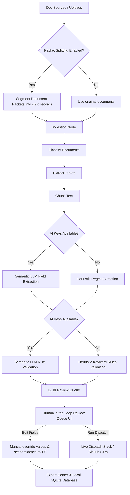

# DocuFlow AI

**DocuFlow AI** is a multi-document intelligence and workflow automation platform for batch document parsing, document classification, structured extraction, table handling, multi-document Q&A, rule validation, human review queues, workspace connectors, workflow automation, and audit-ready exports.

It is designed for document-heavy operations such as vendor onboarding, contract review, invoice processing, compliance evidence review, RFP/SOW analysis, research review, financial document screening, and internal business workflow automation.

---

## Architecture Blueprint



---

## What DocuFlow AI does

DocuFlow AI turns messy document packets into structured, searchable, reviewable intelligence.

```text
Upload documents
→ split composite packets
→ classify document types
→ extract text and tables
→ create searchable chunks
→ semantic LLM field extraction
→ semantic LLM rule validation
→ answer questions with citations
→ human-in-the-loop review and editing
→ live workspace connectors dispatch
→ build intake/export workflows
→ export reports and audit packs
```

The app works locally and can run without an API key using heuristic extraction and rule validation. Optional AI provider keys can be added for richer Q&A synthesis, semantic field extraction, and rule validation.

---

## Key features

### Document workspace & Pipeline

- **Batch document upload**: Upload PDFs, DOCX, TXT, CSV, Excel, or ZIP packets.
- **Smart Packet Splitting**: Dynamically splits large composite documents containing page breaks (`[Page X]` or `\x0c`) into individual logical child document records.
- **Local SQLite database**: Stores all documents, chunks, fields, findings, reviews, and traces automatically.
- **AI status indicator**: Displays active model route (Gemini / Anthropic / local fallback).

---

### Intelligent Semantic Engine

- **Semantic LLM Field Extraction**: If API keys are configured, extracts fields (for invoice, contract, policy templates) using structured JSON model outputs with confidence metrics and exact citation coordinates. Falls back to regex heuristics locally.
- **Semantic LLM Rule Validation**: Runs compliance checklists against documents using LLM reasoning (for natural language requirements) and extracts compliance evidence. Falls back to keyword analysis locally.
- **Dynamic Rules Editor**: In-app spreadsheet editor under the Validation tab to create, modify, or delete rules, and immediately re-evaluate current documents in real-time.

---

### Human-in-the-Loop Review Queue

- **Interactive Exception Handler**: Correct and override extracted fields directly in review card inputs. Manually verified values have confidence promoted to `1.0` and update database tables.
- **Manual Field Additions**: Add any missing structured fields right from the review queue cards.
- **Live Connectors Dispatch**: Execute payload triggers directly on the reviews. Select target system (Slack, GitHub, Jira) and live dispatch messages, webhooks, or issues.

---

### Comparison & Evaluation Labs

- **Comparison Lab**: Select and compare two documents side-by-side. Computes Jaccard term-overlap similarity, extracts shared/unique keywords, and checks for major clause mismatches (termination, liability, payment terms). Optional Premium AI generates a 1-paragraph summary report.
- **Evaluation Lab**: Displays observability score and pipeline diagnostics scorecard checking table extraction, rule validation, chunking, and metadata integrity.

---

### Document classification

DocuFlow AI classifies uploaded documents into categories such as:

- Contract
- Invoice
- Policy
- RFP
- SOW
- Proposal
- Resume
- Financial report
- Compliance evidence
- Research paper
- Table data
- Unknown document type

Each document includes:

- filename
- file type
- detected document type
- classification confidence
- page/character counts
- processing status
- parse errors if any

---

### Structured extraction

The platform extracts structured fields from supported document types.

Example invoice fields:

- vendor
- invoice number
- invoice date
- due date
- total amount
- payment terms

Example contract fields:

- parties
- effective date
- payment terms
- term
- termination clause
- liability clause
- governing law

Example policy fields:

- policy name
- incident notification terms
- required items

---

### Template-based extractors

The frontend includes extraction template selection for:

- Auto-detect
- Invoice extractor
- Contract extractor
- RFP extractor
- SOW extractor
- Policy extractor
- Resume extractor
- Compliance evidence extractor
- Financial report extractor

This gives the app a product-style workflow where the user can choose the type of extraction they want to run.

---

### Table handling

DocuFlow AI supports table files such as:

- CSV
- Excel `.xlsx`
- Excel `.xls`

The app displays uploaded tables and lets users export them as CSV.

Future roadmap includes advanced table extraction from scanned PDFs and complex PDF tables using tools such as Docling, Camelot, Tabula, or OCR-based pipelines.

---

### Multi-document Q&A with citations

Users can ask questions across all processed documents.

Example questions:

```text
Which documents mention payment terms?
Which contract has termination language?
Which invoice has the highest total amount?
Which documents are missing required security evidence?
Which policy mentions incident notification?
```

The system returns:

- answer
- source document
- citation/chunk reference
- evidence snippet
- relevance score

---

### Rule validation engine

Users can upload validation rules or use the included sample rule set.

Example validation rules:

```text
Payment terms must be present
Termination clause must be present
Liability clause must be present
Invoice number must be present
Total amount must be present
Incident notification requirement should be present
```

Validation output includes:

- rule ID
- document name
- requirement
- pass/fail/review status
- severity
- evidence
- confidence

---

### Human review queue

DocuFlow AI creates review items when:

- document parsing fails
- classification confidence is low
- structured extraction is missing
- validation rules fail
- a document needs manual review

The review queue includes workflow-style actions:

- Approve
- Reject
- Mark fixed
- Export task
- Add reviewer comment

Export task prepares a connector-ready payload, for example a Jira review task.

---

## Connector Marketplace

DocuFlow AI includes a frontend connector marketplace, similar to modern workspace-connected AI platforms.

The marketplace helps users configure workspace tools without hardcoding secrets into the repo.

Each connector includes:

- connector name
- category
- description
- auth type
- required environment variables
- connection status
- setup instructions
- sample action payload
- test connection button
- downloadable `.env` snippet
- connector audit log entry

---

## Supported connector categories

### Document Sources

- Google Drive
- Gmail
- Dropbox
- OneDrive
- Amazon S3

### Workflow Actions

- Slack
- Jira
- GitHub
- Notion

### Business Systems

- Airtable
- HubSpot
- Salesforce

### Databases

- PostgreSQL
- Snowflake

### Automation

- n8n
- Zapier
- Make

---

## Connector setup flow

The connector UI follows this flow:

```text
Select connector
→ view setup instructions
→ inspect required environment variables
→ generate .env snippet
→ test connector readiness
→ preview action payload
→ add to workflow builder
→ export connector manifest
```

The public version does not store secrets in the UI. It checks whether required environment variables are present in `.env`.

Example `.env` snippet for Slack:

```env
# Slack connector
SLACK_WEBHOOK_URL=
```

Example `.env` snippet for GitHub:

```env
# GitHub connector
GITHUB_TOKEN=
GITHUB_REPO=
```

Example `.env` snippet for Google Drive:

```env
# Google Drive connector
GOOGLE_DRIVE_CLIENT_ID=
GOOGLE_DRIVE_CLIENT_SECRET=
```

---

## Connector action payloads

Each connector can generate a sample payload for safe testing.

Example Jira payload:

```json
{
  "action": "jira.create_ticket",
  "project_key": "DOC",
  "title": "Missing liability clause in contract",
  "priority": "High",
  "source_document": "vendor_contract.pdf",
  "connector_id": "jira",
  "connector_name": "Jira",
  "execution_mode": "simulation_safe"
}
```

Example Slack payload:

```json
{
  "action": "slack.send_review_alert",
  "channel": "#document-review",
  "message": "3 documents need human review.",
  "connector_id": "slack",
  "connector_name": "Slack",
  "execution_mode": "simulation_safe"
}
```

---

## Connector audit log

DocuFlow AI tracks connector activity such as:

- open connect flow
- test connection
- prepare sample payload
- create review task payload

This gives the platform an audit trail for workspace integration activity.

---

## Workflow Builder

DocuFlow AI includes a workflow builder for document intake and export automation.

### Intake workflow examples

```text
Google Drive folder
→ fetch new PDFs/DOCX files
→ run DocuFlow pipeline
→ classify documents
→ extract fields
→ validate rules
→ create review queue
```

```text
Gmail attachments
→ import documents from search query
→ classify invoice/contract/policy
→ extract structured fields
→ export findings
```

### Export workflow examples

```text
Validation failure
→ create Jira task
→ notify Slack channel
→ export audit pack
```

```text
Pipeline completed
→ export fields to PostgreSQL
→ archive report to S3
→ create Notion summary page
```

Workflow builder fields include:

- source connector
- schedule
- allowed document types
- destination connector
- trigger condition
- output payloads
- workflow JSON export

---

## LangGraph workflow

The core document pipeline uses a real LangGraph workflow:

```text
ingest_documents
→ classify_documents
→ extract_tables
→ build_chunks
→ structured_extraction
→ rule_validation
→ human_review
→ export_packaging
```

The workflow trace is shown in the UI and exported for auditability.

---

## Optional AI setup

DocuFlow AI works without an API key.

Optional provider keys can be added to `.env`:

```env
GEMINI_API_KEY=
GEMINI_MODEL=gemini-flash-latest

ANTHROPIC_API_KEY=
ANTHROPIC_MODEL=claude-sonnet-4-6

DEFAULT_PROVIDER=auto
```

The app can run in:

- local heuristic mode
- Gemini mode
- Anthropic mode
- automatic provider routing mode

---

## Export Center

DocuFlow AI can export:

- documents CSV
- extracted fields CSV
- validation findings CSV
- review queue CSV
- pipeline trace CSV
- Q&A history JSON
- connector manifest JSON
- workflow JSON
- Markdown report
- local SQLite database
- export ZIP package

The export pack is useful for client review, audit trails, and downstream automation.

---

## Run locally

### Windows

```powershell
python -m venv .venv
.\.venv\Scripts\activate
pip install -r requirements.txt
copy .env.example .env
streamlit run app.py
```

### macOS / Linux

```bash
python3 -m venv .venv
source .venv/bin/activate
pip install -r requirements.txt
cp .env.example .env
streamlit run app.py
```

---

## Quick test

1. Run the app.
2. Open **Workspace**.
3. Select **Use sample document pack**.
4. Click **Run document pipeline**.
5. Open **Dashboard** to inspect document types.
6. Open **Extraction** to see extracted fields.
7. Open **Document Q&A** and ask a question.
8. Open **Validation** to review checklist results.
9. Open **Review Queue** to approve/reject/fix/export review items.
10. Open **Connector Marketplace** to configure and test workspace connectors.
11. Open **Workflow Builder** to create intake/export workflows.
12. Open **Export** to download reports and audit artifacts.

---

## Example use cases

- Vendor onboarding packet review
- Contract clause extraction
- Invoice processing
- Compliance evidence review
- RFP/SOW analysis
- Procurement document screening
- Policy review
- Research paper review
- Resume/job-description comparison
- Financial document review
- Internal document workflow automation
- Workspace-connected document operations

---

## Tech stack

- Python
- Streamlit
- LangGraph
- LangChain Core
- Pydantic
- Pandas
- Plotly
- pypdf
- python-docx
- OpenPyXL
- SQLite
- RapidFuzz
- optional Gemini API
- optional Anthropic API
- environment-based connector setup
- JSON/CSV/Markdown/ZIP exports

---

## Folder structure

```text
docuflow_ai/
│
├── app.py
├── README.md
├── requirements.txt
├── .env.example
├── .gitignore
├── run_windows.bat
├── run_mac_linux.sh
│
├── sample_data/
│   ├── sample_contract.txt
│   ├── sample_invoice.txt
│   ├── sample_policy.txt
│   ├── validation_rules.csv
│   └── connectors.csv
│
├── src/
│   ├── __init__.py
│   ├── doc_graph.py
│   ├── intelligence.py
│   ├── loaders.py
│   ├── models.py
│   ├── provider_router.py
│   ├── reporting.py
│   ├── ui_styles.py
│   └── workspace_connectors.py
│
└── outputs/
    ├── docuflow.db
    └── docuflow_export_pack.zip
```

---


## Roadmap

Planned improvements:

- OCR for scanned PDFs and images
- advanced PDF table extraction with Docling/Camelot/Tabula
- vector database indexing
- document packet splitting by section/page range
- invoice vs purchase order matching
- contract vs policy comparison
- proposal vs RFP comparison
- resume vs job description matching
- compliance control mapping
- Google Drive ingestion
- Gmail attachment import
- S3 archive connector
- Slack notification connector
- Jira ticket creation
- GitHub issue creation
- Notion/Airtable/HubSpot exports
- PostgreSQL backend
- FastAPI service layer
- user authentication
- role-based review queues
- scheduled workflows
- evaluation lab for extraction/citation accuracy
- connector marketplace persistence
- deployment templates

---

## Safety and privacy

- Public connector actions are simulation-safe by default.
- Exported reports should be reviewed before operational use.
- Legal, financial, compliance, and contractual findings should be verified against original source documents.


---

## Disclaimer

DocuFlow AI is a document intelligence and workflow automation tool. Extracted data, legal clauses, financial fields, and compliance findings should be reviewed against the original source documents before decisions are made.
